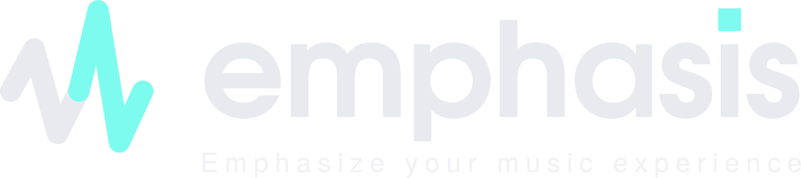

  <picture>
    <source media="(prefers-color-scheme: dark)" srcset="web/public/brand/emphasis-logo-lockup.svg">
    <source media="(prefers-color-scheme: light)" srcset="web/public/brand/emphasis-logo-lockup-on-light.svg">
    
  </picture>

  <em>Unofficial, open-source tools for <a href="https://tidal.com">TIDAL</a>,
  built on the official <a href="https://developer.tidal.com/">TIDAL Open API</a>.</em>

  <a href="https://emphasize.me"><b>emphasize.me</b></a> — live instance

---

## Tools

| Tool | What it does |
|---|---|
| **[Your Weekly Mix](web/README.md#your-weekly-mix)** (`/your-weekly-mix`) | Assembles a personal 20-track weekly playlist from your own library using a transparent scoring algorithm — on demand or fully automatic. |
| **[Shared Playlist](web/README.md#shared-playlist)** (`/shared-playlist`) | Share one playlist with friends. Everyone keeps their own copy; permitted changes are merged daily. Per-person add/remove rights, invite link, manual sync. |

Both tools live in a single web app under [`web/`](web/) and share the login, API client
and design. Available in **English and German** (detected from the browser language).

**→ [Full documentation, self-hosting and tuning guide](web/README.md)**

---

Emphasis is an independent community project and is **not affiliated with TIDAL**.
TIDAL is a trademark of TIDAL Music AS.
